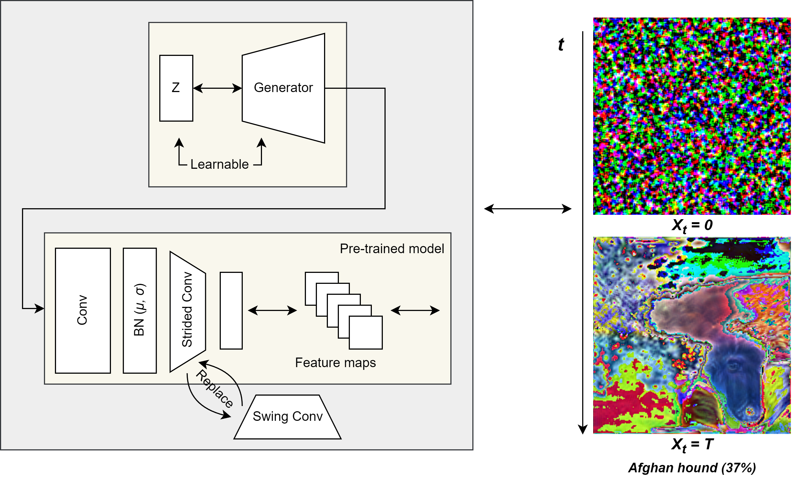

# genie-reproducibility
This repository contains the code for reproducing the results of the paper ["Genie: Show Me the Data for Quantization"](https://arxiv.org/abs/2212.04780) CVPR 2023 paper



## Getting Started
### Installation
```bash
git clone https://github.com/smohammadhejazi/genie-reproducibility
cd genie-reproducibility
pip3 install -r requirements.txt
```

### Usage
```bash
# Generating dataset using using ResNet18
python3 main.py --model_name=resnet18 -d

```
Detailed descriptions of arguments are provided in [main.py](main.py).

## Project Structure

A breakdown of key files in this repository:

- **`main.py`** — The entry point of the project; parses command-line arguments to optionally run model distillation, quantization, reconstruction, and evaluation using a selected pretrained model.
- **`distil.py`** — Implements synthetic dataset generation through batch norm statistics and generator training.
- **`evaluation.py`** — Evaluates model performance on a dataset using top-1 accuracy, including support for standard and quantized models.
- **`reconstruction.ipynb`** — Performs weight and activation quantization of ResNet-18 using a synthetic dataset and a teacher-student distillation approach, optimizing quantization scales via reconstruction loss.


## License
This project is released under the [GNU GENERAL PUBLIC LICENSE](LICENSE).
